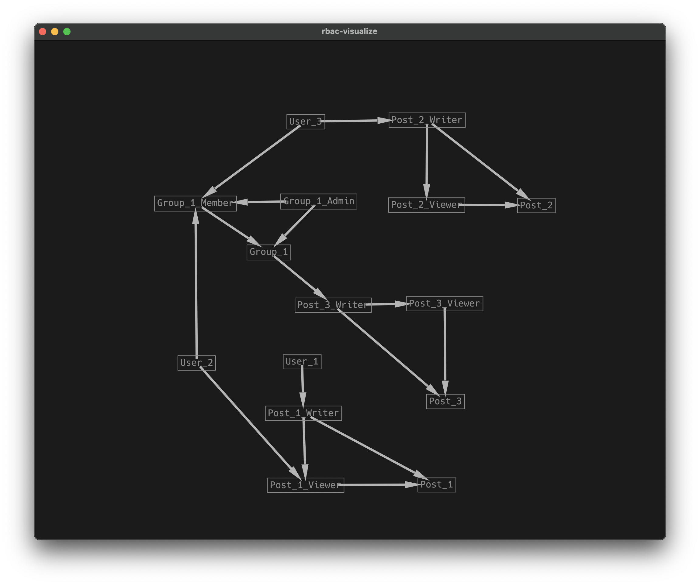

# rbac-rs

An implementation of RBAC(Role-Based Access Control) written in Rust.

Inspired by Google Zanzibar, this project represents entities and roles as a graph structure.


## Projects
* [rbac-macro](./rbac-macro/) some macros for defining namespace, role, node.
* [rbac](./rbac/) the core library of RBAC.
* [rbac-example](./rbac-example/) an example of how to use this library and test modules.
* [rbac-visualize](./rbac-visualize/) a tool for visualizing the graph structure of RBAC.


## Example
You can find the example in [rbac-example](./rbac-example/).



```rust
// alice is a writer
let r = EntityRelationship::new(&UESR_ALICE, &PostRoles::Writer, &POST_BY_ALICE);
server.add_relationship(&r).unwrap();

// role inherits automatically
let test = EntityRelationship::new(&UESR_ALICE, &PostRoles::Viewer, &POST_BY_ALICE);
let result = server.allowed(&test);
// alice is a writer and it means also a viewer.
assert_eq!(result.unwrap(), true);

let r = EntityRelationship::new(&USER_BOB, &PostRoles::Viewer, &POST_BY_ALICE);
server.add_relationship(&r).unwrap();

let test = EntityRelationship::new(&USER_CHARLIE, &PostRoles::Viewer, &POST_BY_ALICE);
let result = server.allowed(&test);
// charlie is not a node yet... so it should return an error
assert_eq!(result.is_err(), true);

// charlie write a post
let r = EntityRelationship::new(&USER_CHARLIE, &PostRoles::Writer, &POST_BY_CHARLIE);
server.add_relationship(&r).unwrap();

// now charlie is a node
let result = server.allowed(&test);
assert_eq!(result.is_ok(), true);
// but can't view alice's post
assert_eq!(result.unwrap(), false);

// charlie and bob joins the group foo
let r = EntityRelationship::new(&USER_BOB, &GroupRoles::Member, &GROUP_FOO);
server.add_relationship(&r).unwrap();

let r = EntityRelationship::new(&USER_CHARLIE, &GroupRoles::Member, &GROUP_FOO);
server.add_relationship(&r).unwrap();

// group foo writes a post
let r = EntityRelationship::new(&GROUP_FOO, &PostRoles::Writer, &POST_BY_FOO);
server.add_relationship(&r).unwrap();

// charlie can view the post by foo
let test = EntityRelationship::new(&USER_CHARLIE, &PostRoles::Viewer, &POST_BY_FOO);
let result = server.allowed(&test);
```

